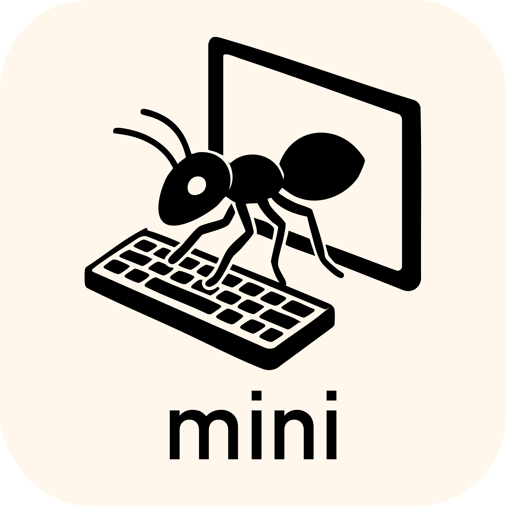

<p align="center">
  <a href="https://swe-agent.com/latest/">
    
  </a>
</p>

<p align="center">
<a href="https://swe-agent.com/latest/"></a>
<a href="https://join.slack.com/t/swe-bench/shared_invite/zt-36pj9bu5s-o3_yXPZbaH2wVnxnss1EkQ"></a>
<a href="https://arxiv.org/abs/2405.15793"></a>
</p>


SWE-agent enables your language model of choice (e.g. GPT-4o or Claude Sonnet 4) to autonomously use tools to
[fix issues in real GitHub repositories](https://swe-agent.com/latest/usage/hello_world),
[find cybersecurity vulnerabilities](https://enigma-agent.com/), or
[perform any custom task](https://swe-agent.com/latest/usage/coding_challenges).

* ✅ **State of the art** on SWE-bench among open-source projects
* ✅ **Free-flowing & generalizable**: Leaves maximal agency to the LM
* ✅ **Configurable & fully documented**: Governed by a single `yaml` file
* ✅ **Made for research**: Simple & hackable by design

SWE-agent is built and maintained by researchers from Princeton University and Stanford University.

## 📣 News

* July 24: [Mini-SWE-Agent](https://github.com/SWE-agent/mini-SWE-agent) achieves 65% on SWE-bench verified in 100 lines of python!
* May 2: [SWE-agent-LM-32b](https://github.com/SWE-bench/SWE-smith) achieves open-weights SOTA on SWE-bench
* Feb 28: [SWE-agent 1.0 + Claude 3.7 is SoTA on SWE-Bench full](https://x.com/KLieret/status/1895487966409298067)
* Feb 25: [SWE-agent 1.0 + Claude 3.7 is SoTA on SWE-bench verified](https://x.com/KLieret/status/1894408819670733158)
* Feb 13: [Releasing SWE-agent 1.0: SoTA on SWE-bench light & tons of new features](https://x.com/KLieret/status/1890048205448220849)
* Dec 7: [An interview with the SWE-agent & SWE-bench team](https://www.youtube.com/watch?v=fcr8WzeEXyk)

## 🚀 Get started!

👉 Try SWE-agent in your browser: [](https://codespaces.new/SWE-agent/SWE-agent) ([more information](https://swe-agent.com/latest/installation/codespaces/))

Read our [documentation][docs] to learn more:

* [Installation](https://swe-agent.com/latest/installation/source/)
* [Hello world from the command line](https://swe-agent.com/latest/usage/hello_world/)
* [Benchmarking on SWE-bench](https://swe-agent.com/latest/usage/batch_mode/)
* [Frequently Asked Questions](https://swe-agent.com/latest/faq/)

[docs]: https://swe-agent.com

## SWE-agent for offensive cybersecurity (EnIGMA) <a name="enigma"></a>

</img>

[SWE-agent: EnIGMA][enigma] is a mode for solving offensive cybersecurity (capture the flag) challenges.
EnIGMA achieves state-of-the-art results on multiple cybersecurity benchmarks (see [leaderboard](https://enigma-agent.com/#results)).
Please use [SWE-agent 0.7](https://github.com/SWE-agent/SWE-agent/tree/v0.7) while we update EnIGMA for 1.0.

[enigma]: https://enigma-agent.com
[SWE-bench]: https://github.com/SWE-bench/SWE-bench
[nyu-ctf]: https://arxiv.org/abs/2406.05590

In addition, you might be interested in our other projects:


<div align="center">
  <a href="https://github.com/SWE-agent/mini-SWE-agent"></a>
   &nbsp;&nbsp;
  <a href="https://github.com/SWE-agent/SWE-ReX"></a>
   &nbsp;&nbsp;
  <a href="https://github.com/SWE-bench/SWE-bench"></a>
  &nbsp;&nbsp;
  <!-- <a href="https://github.com/SWE-agent/SWE-agent"></a> -->
  <a href="https://github.com/SWE-bench/SWE-smith"></a>
  &nbsp;&nbsp;
  <a href="https://github.com/SWE-bench/sb-cli"></a>
</div>

## Contributions <a name="contributions"></a>

If you'd like to contribute to the codebase, we welcome [issues](https://github.com/SWE-agent/SWE-agent/issues) and [pull requests](https://github.com/SWE-agent/SWE-agent/pulls)! For larger code changes, we always encourage discussion in issues first.

## Citation & contact <a name="citation"></a>

SWE-agent is an academic project started at Princeton University by John Yang*, Carlos E. Jimenez*, Alexander Wettig, Kilian Lieret, Shunyu Yao, Karthik Narasimhan, and Ofir Press.
Contact person: [John Yang](https://john-b-yang.github.io/), [Carlos E. Jimenez](http://www.carlosejimenez.com/), and [Kilian Lieret](https://www.lieret.net/) (Email: johnby@stanford.edu, carlosej@cs.princeton.edu, kl5675@princeton.edu).

If you found this work helpful, please consider citing it using the following:

<details>
<summary> SWE-agent citation</summary>

```bibtex
@inproceedings{yang2024sweagent,
  title={{SWE}-agent: Agent-Computer Interfaces Enable Automated Software Engineering},
  author={John Yang and Carlos E Jimenez and Alexander Wettig and Kilian Lieret and Shunyu Yao and Karthik R Narasimhan and Ofir Press},
  booktitle={The Thirty-eighth Annual Conference on Neural Information Processing Systems},
  year={2024},
  url={https://arxiv.org/abs/2405.15793}
}
```
</details>

If you used the summarizer, interactive commands or the offensive cybersecurity capabilities in SWE-agent, please also consider citing:

<details>
<summary>EnIGMA citation</summary>

```bibtex
@misc{abramovich2024enigmaenhancedinteractivegenerative,
      title={EnIGMA: Enhanced Interactive Generative Model Agent for CTF Challenges},
      author={Talor Abramovich and Meet Udeshi and Minghao Shao and Kilian Lieret and Haoran Xi and Kimberly Milner and Sofija Jancheska and John Yang and Carlos E. Jimenez and Farshad Khorrami and Prashanth Krishnamurthy and Brendan Dolan-Gavitt and Muhammad Shafique and Karthik Narasimhan and Ramesh Karri and Ofir Press},
      year={2024},
      eprint={2409.16165},
      archivePrefix={arXiv},
      primaryClass={cs.AI},
      url={https://arxiv.org/abs/2409.16165},
}
```
</details>


## 🪪 License <a name="license"></a>
MIT. Check `LICENSE`.


<div align="center">

[](https://github.com/SWE-agent/SWE-agent/actions/workflows/pytest.yaml)
[](https://github.com/SWE-agent/SWE-agent/actions/workflows/build-docs.yaml)
[](https://codecov.io/gh/SWE-agent/SWE-agent)
[](https://results.pre-commit.ci/latest/github/SWE-agent/SWE-agent/main)
[](https://github.com/SWE-agent/SWE-agent/actions/workflows/check-links-periodic.yaml)

</div>
