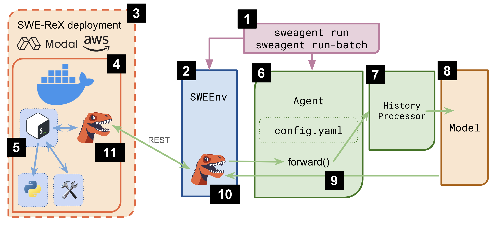

# Architecture

This page walks you through the general architecture of the SWE-agent package. Want to just run it? Jump ahead to the [installation](../installation/index.md) or [usage](../usage/index.md) sections.

The central entry point to SWE-agent is the `sweagent` command line executable (1). It initializes an instance of the [`SWEEnv`](../reference/env.md) class (2) that manages the environment.
With SWE-agent 1.0, this class is now merely a thin wrapper around our [SWE-ReX](https://swe-rex.com) package.
Upon initialization, `SWEEnv` initializes the SWE-ReX _Deployment_. The Deployment either starts a local Docker container (4), or it starts the container on a remote system like modal or aws (3).
Within the container, SWE-ReX starts a shell session (5) that will be used to execute the commands.
SWE-ReX also installs the [ACI](aci.md) elements as [custom tools](../config/tools.md) (9) that are available to the shell session.

The second class that is initialized by is the [`Agent`](../reference/agent.md) (6). It can be configured with a yaml file (see [config](../config/config.md)). It's most important method is `forward()` which prompts the model and executes its action.

To prompt the model, the history (all prompts to the model together with actions and outputs) need to be sent to the LM. In order to make the best use of the context window of the model, the history gets compressed by a `HistoryProcessor` (7). The model output (8) is then interpreted by the `Agent` class (in particular, we use a [parser](../reference/parsers.md) to extract the action) and executed in the Shell session via `SWEEnv` (10).

For this, `SWEEnv` holds the SWE-ReX deployment class that talks to a server running within the docker container (11).